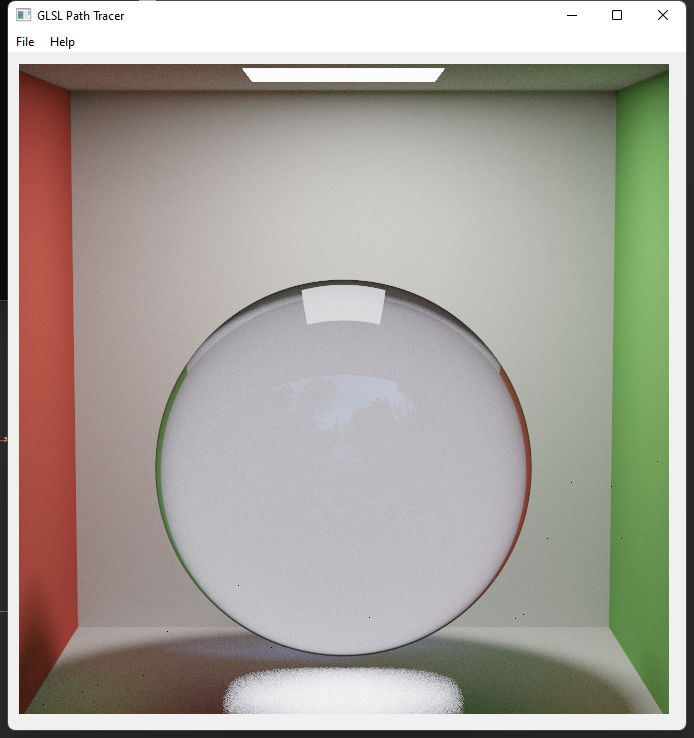
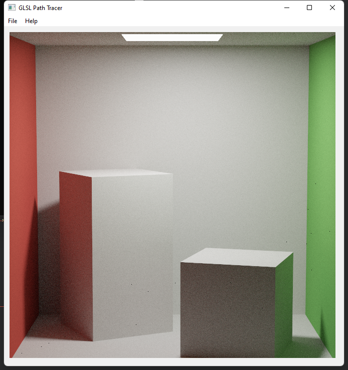

Overview
------------
Implemented bidirectional scattering & reflectance distribution function (BSDF, BRDF) with OpenGL to render photo-realistic graphics. Features: diffuse surface scattering, specular surface bounces and refracting, micro-surface (metal) scattering, HDR environment lighting.

Rendering Results  
------------

